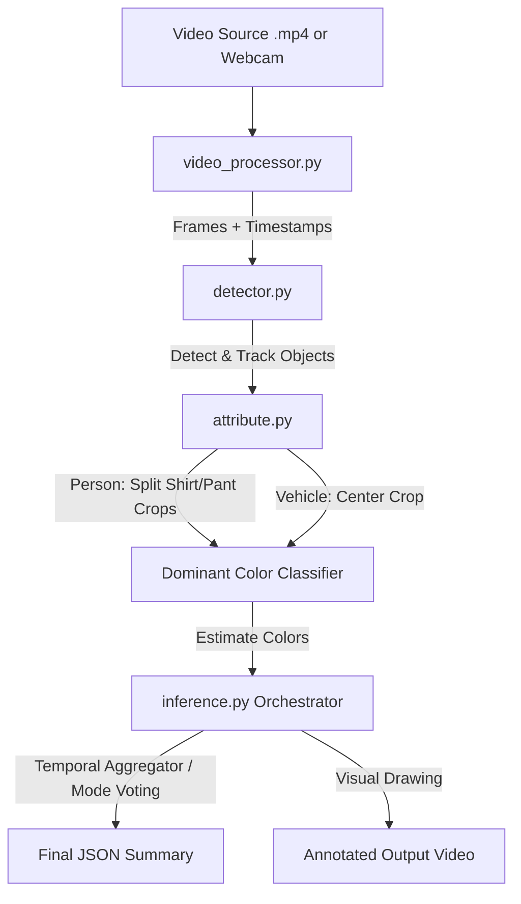

# CrimeVision-YOLO Video Intelligence Engine

This project is a dedicated workspace for training custom YOLO models and running a modular, frame-by-frame video intelligence pipeline for the **CrimeVision** surveillance project.

---

## Modular Engine Architecture

The inference pipeline is designed to be highly modular, separating video handling, detection, tracking, attribute extraction, and drawing:

```text
CrimeVision-YOLO/
│── dataset/              # Used for YOLO training
│── weights/              # Custom model weights
│
│── video_processor.py    # OpenCV frame-by-frame parser & timestamp generator
│── detector.py           # YOLO inference and tracking wrapper (ByteTrack)
│── attribute.py          # Color & attribute classifier using HSV spatial heuristics
│── utils.py              # Visual annotation drawing helpers
│── inference.py          # Orchestrates the modular pipeline and exports temporal summaries
│
│── train.py              # Custom model training script
│── detect.py              # Legacy / simple batch detection script
│
│── requirements.txt      # Python dependencies (ultralytics, opencv, supervision)
└── README.md             # Documentation
```

---

## How It Works



1. **Video Processor (`video_processor.py`)**: Loads the video and reads it frame-by-frame, converting frame indices into exact timestamps (`HH:MM:SS.MS`).
2. **Detector (`detector.py`)**: Wraps YOLO to run detection and tracking (`ByteTrack` or `BoT-SORT`) to yield persistent track IDs for objects.
3. **Attribute Extractor (`attribute.py`)**: Takes coordinates of objects and clips the frame:
   - **Person**: Crops upper-body (shirt) and lower-body (pants) using spatial percentage bounds to avoid background and shoes.
   - **Vehicle**: Center-crops to capture primary vehicle color.
   - Classifies colors by mapping HSV pixels into quantized color categories (Red, Orange, Yellow, Green, Blue, Purple, Pink, Brown, Black, White, Gray).
4. **Temporal Aggregation**: Tracked objects are grouped across the entire video. The engine votes on the most frequent color class detected for each unique track ID and saves the timestamp of their first appearance.
5. **Output Generation**: Outputs a structured JSON file containing summary records and can optionally save a fully annotated video representation.

---

## Installation & Setup

1. **Navigate to the directory:**
   ```bash
   cd CrimeVision-YOLO
   ```

2. **Activate the virtual environment:**
   ```bash
   source venv/bin/activate
   ```

3. **Verify requirements are installed:**
   ```bash
   pip install -r requirements.txt
   ```

---

## Running the Video Intelligence Pipeline

To run the pipeline on an input video:

```bash
python3 inference.py \
  --model yolo11s.pt \
  --source path/to/video.mp4 \
  --save-json output.json \
  --save-video output_annotated.mp4
```

### Parameters:
- `--model`: Path to model weights (defaults to `runs/detect/train/weights/best.pt` if trained, otherwise falls back to pretrained `yolo11s.pt`).
- `--source`: Path to an `.mp4` video file, or `"0"` to run on a local webcam.
- `--conf`: Confidence threshold for detections (default: `0.25`).
- `--save-json`: Destination path for the structured JSON analysis (default: `output.json`).
- `--save-video`: Optional path to write the annotated video with bounding boxes and attribute text tags.
- `--show`: Add this flag to open a GUI window rendering the live analysis.

---

## Structured JSON Output Example

The output JSON report is fully optimized for ingestion by a Next.js/FastAPI frontend dashboard:

```json
{
  "video_name": "street_footage.mp4",
  "duration": "18.2s",
  "detections": [
    {
      "timestamp": "00:00:03.450",
      "track_id": 1,
      "object": "Person",
      "confidence": 0.96,
      "shirt_color": "Red",
      "pant_color": "Black"
    },
    {
      "timestamp": "00:00:05.100",
      "track_id": 7,
      "object": "Vehicle",
      "confidence": 0.94,
      "vehicle_color": "White"
    },
    {
      "timestamp": "00:00:08.200",
      "track_id": 10001,
      "object": "Knife",
      "confidence": 0.88
    }
  ]
}
```
*(Note: Track IDs above 10000 are synthetically assigned to untracked classes like weapons or hazards, allowing temporal event grouping).*
